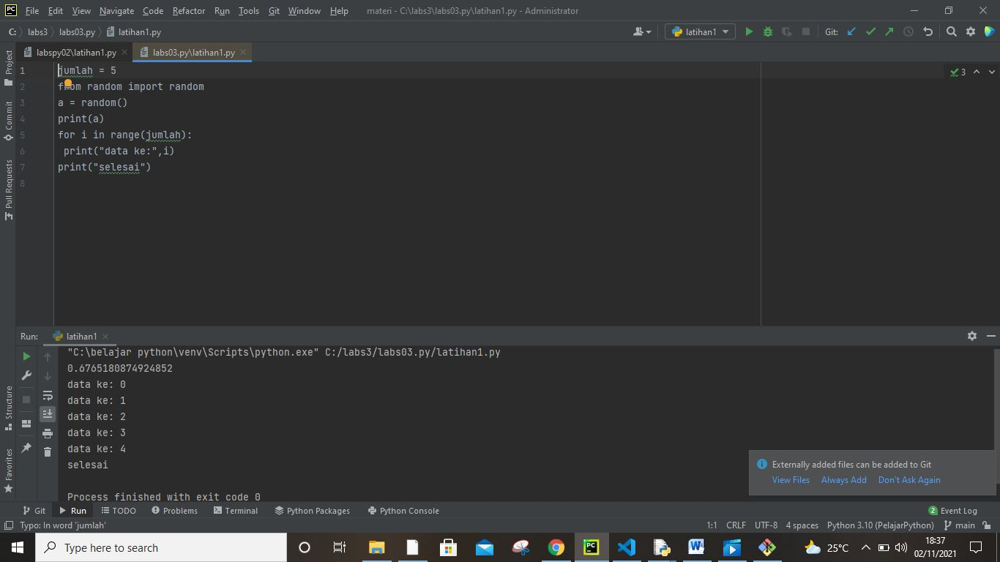
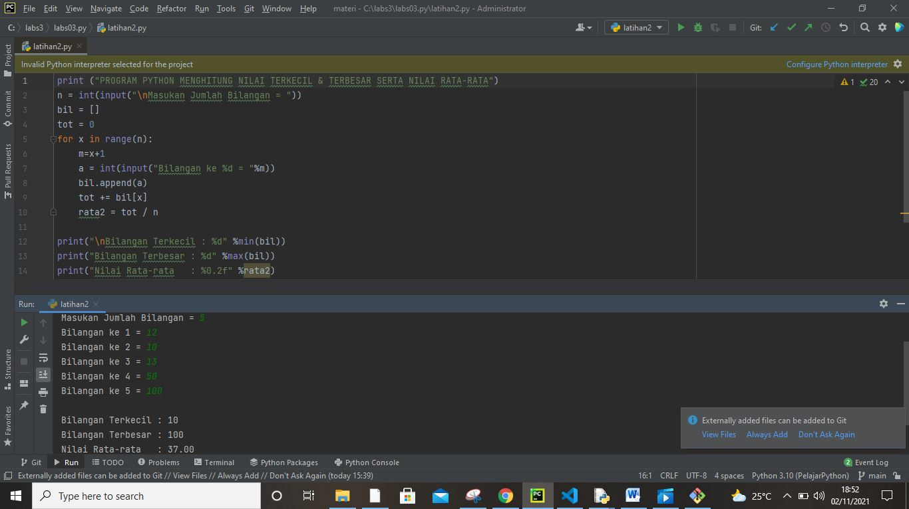
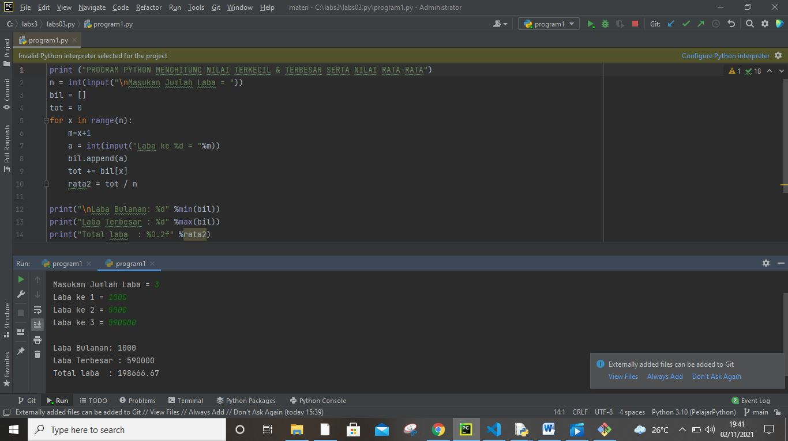

# labs03.py
## Modul Praktikum 3 perulangan
### Ini dia programnnya

1) pelatihan1.py'
'
scrip codingannya
jumlah = 5
from random import random
a = random()
print(a)
for i in range(jumlah):
 print("data ke:",i)
print("selesai")'
'

2) pelatihan2.py'
'

scrip codingnya'
'
print ("PROGRAM PYTHON MENGHITUNG NILAI TERKECIL & TERBESAR SERTA NILAI RATA-RATA")
n = int(input("\nMasukan Jumlah Bilangan = "))
bil = []
tot = 0
for x in range(n):
    m=x+1
    a = int(input("Bilangan ke %d = "%m))
    bil.append(a)
    tot += bil[x]
    rata2 = tot / n

print("\nBilangan Terkecil : %d" %min(bil))
print("Bilangan Terbesar : %d" %max(bil))
print("Nilai Rata-rata   : %0.2f" %rata2)'
'
penjelasannya:
Program di atas untuk menghitung nilai terkecil dan terbesar serta nilai rata-rata dari sekelompok bilangan yang kita masukan.

Saat program di jalankan user di minta memasukan jumlah bilangan yang ingin di masukan. Program akan melakukan perulangan berdasarkan jumlah bilangan tersebut.

Setiap nilai yang dimasukan akan di simpan kedalam list bil[] menggunakan metode append(). Metode ini akan menambahkan elemen baru di akhir list.

Baca selengkapnya tipe data list di python

Untuk mendapatkan nilai total maka di jumlahkan semua nilai dalam list bil[] lihat pada sintak tot += bil[x] lalu kemudian di bagi dengan n sebagai jumlah bilangan untuk mendapatkan nilai rata-rata.

 
Untuk mendapatkan nilai tertinggi/maksimal dan nilai terendah/minimal menggunakan fungsi min() dan max(), kedua fungsi ini akan menghasilkan nilai minimal dan maksimal dalam elemen list bil[].'
'

3) Preogram1.py'
'

scrip codingnnya'
'
print ("PROGRAM PYTHON MENGHITUNG NILAI TERKECIL & TERBESAR SERTA NILAI RATA-RATA")
n = int(input("\nMasukan Jumlah Laba = "))
bil = []
tot = 0
for x in range(n):
    m=x+1
    a = int(input("Laba ke %d = "%m))
    bil.append(a)
    tot += bil[x]
    rata2 = tot / n

print("\nLaba Bulanan: %d" %min(bil))
print("Laba Terbesar : %d" %max(bil))
print("Total laba  : %0.2f" %rata2)'
'

Sekian terimakasi '
'

